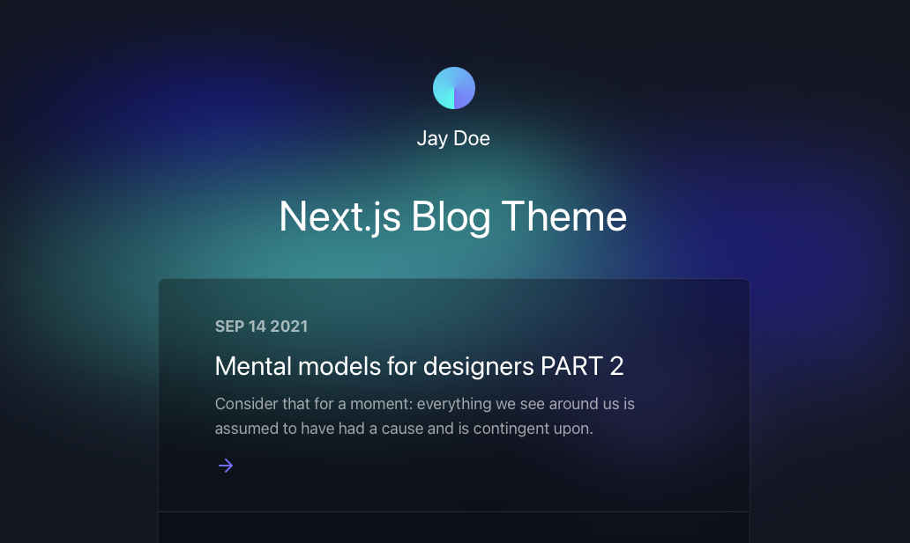
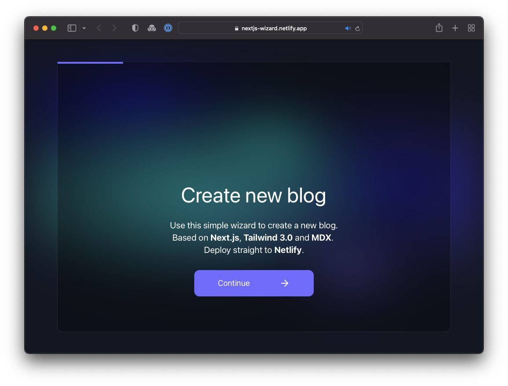

# Next.js Blog Theme Designed by [Bejamas](https://bejamas.io)

[](https://app.netlify.com/start/deploy?repository=https://github.com/netlify-templates/nextjs-blog-theme)

A customizable blog starter using:
- [Next.js](https://github.com/vercel/next.js) v12
- [Tailwind](https://tailwindcss.com/) v3.0
- Built-in [MDX](https://mdxjs.com/) v1 support
- Includes modern design with dark & light themes



[Take a gander at the demo.](https://bejamas-nextjs-blog.netlify.app)

### Getting Started

You can get started with this project in two ways: locally or using the [setup wizard](https://nextjs-wizard.netlify.app/).

#### Setting Up Locally

If you're doing it locally, start with clicking the [use this template](https://github.com/netlify-templates/nextjs-blog-theme/generate) button on GitHub. This will create a new repository with this template's files on your GitHub account. Once that is done, clone your new repository and navigate to it in your terminal. 

From there, you can install the project's dependencies by running:

```shell
yarn install
```

Finally, you can run your project locally with:

```shell
yarn run dev
```

Open your browser and visit <http://localhost:3000>, your project should be running!

#### Using the Setup Wizard



Through the [setup wizard](https://nextjs-wizard.netlify.app/), you can create your blog in a few clicks and deploy to Netlify.

## Configuring the blog

The config is based on environment variables to make it easy to integrate with any Jamstack platform, like Netlify.

Here are the variables you can edit:

- `BLOG_NAME` - that's the name of your blog and will be displayed below the avatar.
- `BLOG_TITLE` - the main header (`h1`) on the home page, this can be a slogan.
- `BLOG_FOOTER_TEXT` - the text in the footer, usually copyright info.
- `BLOG_THEME`
- `BLOG_FONT_HEADINGS` - the font-family for all HTML headings, from `h1` to `h6`. The value can be one of those:
  - `sans-serif` (selected by default)
  - `serif`
  - `monospace`
- `BLOG_FONT_PARAGRAPHS` - the font-family for all other HTML elements. The value can be one of those:
  - `sans-serif` (selected by default)
  - `serif`
  - `monospace`

All of the env variables can be configured through the [Wizard](https://nextjs-wizard.netlify.app/).

## Adding new posts

All posts are stored in `posts` directory in `.mdx` format. That means you can use React components there to make your posts more interactive.
